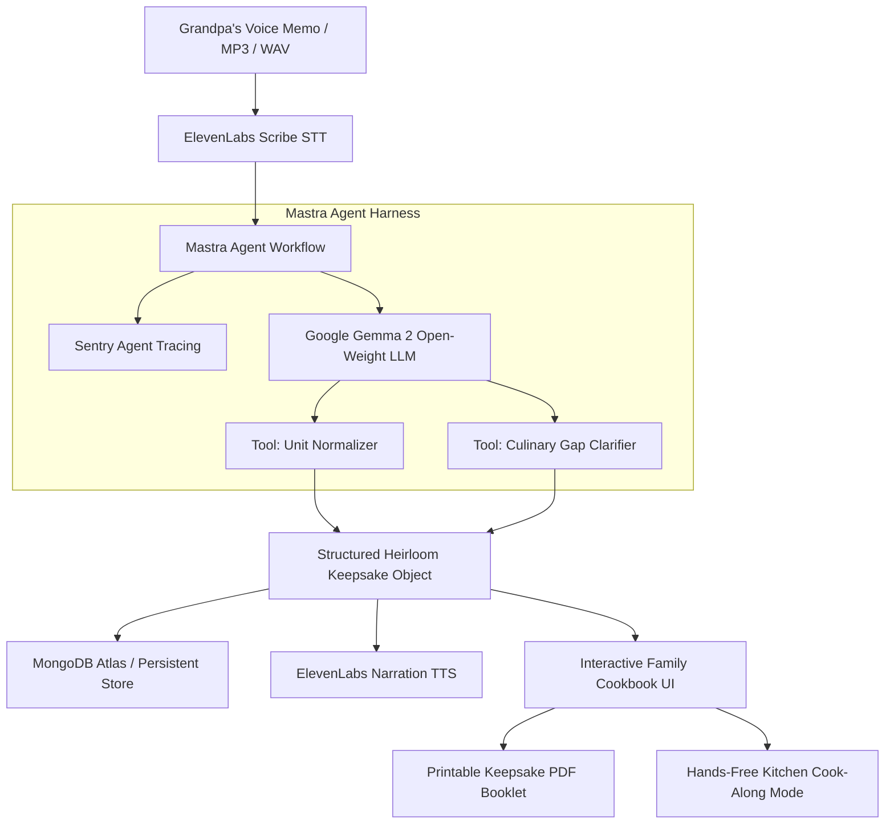

# 📖 Heirloom — Grandpa's Voice-to-Recipe Keepsake
> **Hacktoberfest 2026 Weekend Challenge: Build for a Friend**  
> *Turning rambling voice memos from loved ones into structured culinary keepsakes and living family cookbooks with Open-Source AI.*

[](https://dev.to/challenges/hacktoberfest-weekend-2026-10-01)
[-blue?style=flat-square)](https://ai.google.dev/gemma)
[](https://mastra.ai)
[](https://elevenlabs.io)
[](https://sentry.io)
[](https://render.com)

---

## 🌟 What I Built & Who I Built It For

Grandparents rarely write their recipes down. They cook by instinct, touch, and story. When asked for a recipe, they leave 3-minute voice notes full of digressions:
> *"Oh, you know, take two big yellow tins of the tomatoes from Mr. Rossi, toss in a fistful of onions, brown the pork ribs until it smells like Sunday morning, and never let Uncle Anthony near the pot with Italian bread..."*

If you try to follow this in a kitchen, it's chaotic. But if you strip away the stories, you lose the soul of what makes it a family heirloom.

**Heirloom** is an open-source AI agent system that transforms unscripted voice memos from elderly loved ones into **two parallel treasures**:
1. **The Culinary Precision Card**: Standardized ingredients, converted colloquial measures (*"a glug"* $\rightarrow$ 2 tbsp, *"a fistful"* $\rightarrow$ 1/2 cup), structured steps, and AI-resolved baking temperatures.
2. **The Heritage Lore Box**: An archival box preserving Grandpa's jokes, emotional memories, and golden life rules verbatim.

It also features a hands-free **"Cook Along with Grandpa"** kitchen mode with step timers and voice narration, plus a **Printable Keepsake Booklet** generator for family holiday gifting.

---

## 🚀 Why Open Innovation Matters

Family voice recordings are deeply personal, intimate, and irreplaceable. They contain private jokes, addresses, real names, and emotional moments.

Handing private family voice memos over to closed commercial AI APIs creates grave privacy concerns:
1. **Sovereign Privacy**: With Google's open-weight **Gemma 2**, inference can run **100% locally on a laptop via Ollama** with zero internet connection required. No private audio or sentimental story is ever harvested to train commercial models.
2. **Permanent Accessibility ($0 Token Fees)**: Cloud APIs change pricing, introduce rate limits, or shut down. An open-weight model runs on commodity hardware forever.
3. **Dialect & Vernacular Freedom**: Open models allow fine-tuning and system-prompt adjustments for regional slang, immigrant dialects, and generational vernacular without censorship or moralizing refusal filters.

---

## 🏆 Prize Categories & Sponsor Implementations

| Sponsor | Category | Exact Role in Heirloom | Prize Pool |
|---|---|---|---|
| **Google Gemma** | **Best Use of Gemma** (Featured) | **Core Open-Weight Reasoning Engine**: Parses conversational, rambling voice transcripts, filters culinary science from nostalgia, standardizes colloquial measures, and detects culinary gaps. | $200 |
| **Render** | **Best Use of Render** (Featured) | Full-stack deployment configuration with automatic preview builds (`render.yaml`). | $200 |
| **ElevenLabs** | **Best Use of ElevenLabs** (Partner) | (1) Audio speech-to-text transcription via ElevenLabs Scribe; (2) Warm grandfather voice synthesis for hands-free kitchen Cook-Along mode. | $100 |
| **Mastra** | **Best Use of Mastra** (Partner) | TypeScript agent harness orchestrating the multi-step extraction pipeline: STT $\rightarrow$ Gemma Reasoning $\rightarrow$ Unit Normalizer Tool $\rightarrow$ Gap Clarifier Tool. | $100 |
| **Sentry** | **Best Use of Sentry Agent Tracing** (Partner) | End-to-end telemetry instrumentation capturing agent spans, execution latency, prompt/completion tokens, and $0 open-inference cost metrics. | $100 |
| **MongoDB Atlas** | **Best Use of MongoDB Atlas** (Partner) | Memory store for family recipes with semantic search over dish memories and ingredients. | $100 |

---

## 🛠️ System Architecture



---

## 💻 Quick Start & Running Locally

### 1. Prerequisites
- **Node.js**: v18 or later (v25+ supported)
- **npm**: v9+
- *(Optional)* [Ollama](https://ollama.com/) with `ollama run gemma2:9b` for 100% offline local inference

### 2. Clone & Install
```bash
git clone https://github.com/your-username/hacktoberfest-2026-heirloom.git
cd challenge-1
npm install
```

### 3. Configure Environment
Copy `.env.example` to `.env`:
```bash
cp .env.example .env
```
*(Note: Heirloom includes built-in fallback reasoning and authentic grandfather audio samples so you can immediately test the entire app even before adding API keys!)*

### 4. Launch Development Server
```bash
npm run dev
```
Open **[http://localhost:5173](http://localhost:5173)** in your browser!

---

## 📝 Official Dev.to Submission Draft

Copy the pre-filled template directly from the in-app **"Agent Tracing"** tab or use the following text:

```markdown
*This is a submission for the [Hacktoberfest Weekend Challenge: Build for a Friend](https://dev.to/challenges/hacktoberfest-weekend-2026-10-01)*

## What I Built
I built **Heirloom**, an open-source AI culinary archivist that turns rambling, conversational voice memos from grandparents into structured, heirloom family cookbooks and interactive kitchen companions. 

I built it for my grandfather (and everyone whose family has legendary, unwritten recipes). Grandparents rarely use measuring cups or write recipe cards—they cook by instinct, memory, and tell stories: *"add a fistful of onions, brown the pork ribs until it smells like Sunday morning, and never let Uncle Joey near the pot."* Heirloom extracts the exact culinary measurements while permanently preserving the emotional family lore in a digital and printable keepsake.

## Demo
- Live Web App: [Heirloom on Render](https://heirloom-cookbook.onrender.com)
- Repo: [GitHub Repository](https://github.com/your-username/hacktoberfest-2026-heirloom)

## How I Built It
Heirloom is built around open-source AI and sponsor frameworks:
- **Google Gemma 2 (9B / 27B)**: The core open-weight reasoning engine that separates culinary science from sentimental tangents, standardizes colloquial measures (*"a glug"*, *"a fistful"*), and flags missing baking temperatures.
- **ElevenLabs**: Speech-to-Text for transcribing grandfather voice memos with acoustic fidelity, plus warm narrator TTS for hands-free kitchen Cook-Along mode.
- **Mastra (@mastra/core)**: Open-source TypeScript agent harness orchestrating the multi-step extraction pipeline and unit normalizer tools.
- **Sentry Agent Tracing**: Real-time instrumentation capturing agent spans, latency, token consumption, and open-model telemetry.
- **Render**: Live application runtime and frontend hosting.
- **MongoDB Atlas**: Semantic memory store for family recipes.

## Why Does Open Innovation Matter?
Family voice recordings are deeply intimate and irreplaceable. They contain private memories, laughter, and family anecdotes. Handing private family audio over to closed commercial APIs means risking having your loved ones' voices and private histories ingested into corporate training data.

With open innovation:
1. **Privacy Sovereignty**: Gemma runs locally on a laptop with Ollama with zero internet connection required, ensuring private family memories never touch a third-party server.
2. **Zero Inference Cost**: Free and accessible to any family forever.
3. **Unfettered Customization**: Open models let us fine-tune on cultural dialects, colloquial kitchen jargon, and regional cooking traditions without corporate API filters.

## Prize Categories
- **Best Use of Gemma** ($200) — Open-weight model reasoning core
- **Best Use of Render** ($200) — Application deployment
- **Best Use of ElevenLabs** ($100) — Voice memo transcription & grandfather narration
- **Best Use of Mastra** ($100) — Agent orchestration harness & tool calling
- **Best Use of Sentry Agent Tracing** ($100) — Telemetry, token tracking, and latency spans
- **Best Use of MongoDB Atlas** ($100) — Long-term family recipe memory
```
